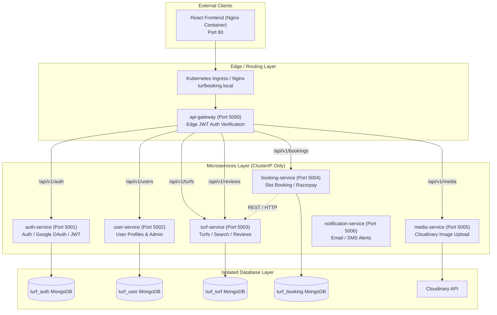

# Turf Booking System — Cloud-Native Microservices Platform

[](https://github.com/praveen6235/Turf-Booking-System/actions/workflows/ci-cd.yml)
[](#architecture)
[](./deploy/k8s)
[](./infra/terraform)
[](./deploy/observability)

Production-ready, cloud-native microservices platform for sports turf reservations, slot booking, payment processing, image uploads, and reviews.

---

## Architecture Diagram



---

## Microservices Breakdown

| Microservice | Directory | Database Scope | Exposed Metrics & Business Metrics | Autoscaling Trigger (HPA) |
| :--- | :--- | :--- | :--- | :--- |
| **`api-gateway`** | `/services/api-gateway` | Stateless | `http_requests_total`, latency | CPU (75%) + Request Rate |
| **`auth-service`** | `/services/auth-service` | `turf_auth` MongoDB | `http_requests_total`, auth counters | CPU (70%) + Memory (80%) |
| **`user-service`** | `/services/user-service` | `turf_user` MongoDB | `http_requests_total`, profile lookups | CPU (70%) |
| **`turf-service`** | `/services/turf-service` | `turf_turf` MongoDB | `turf_search_requests_total` | CPU (70%) + `turf_search_requests_per_second` (>40 req/s) |
| **`booking-service`** | `/services/booking-service` | `turf_booking` MongoDB | `active_booking_requests_in_flight` | CPU (70%) + `http_requests_per_second` (>50 req/s) |
| **`media-service`** | `/services/media-service` | Stateless / Cloudinary | `http_requests_total`, upload duration | CPU (80%) + KEDA Scale-to-Zero Option |
| **`notification-service`** | `/services/notification-service` | Stateless | `http_requests_total`, email count | CPU (70%) |
| **`client`** | `/client` | Nginx Static | Frontend traffic | Replicas (2) |

---

## Shared Workspace Package

- **`packages/common`** (`@turf-booking/common`): Factored out shared utilities (JWT verification helper, custom `AppError`, `catchAsync` wrapper, global `errorHandler` middleware, and Prometheus metrics setup).

---

## Quick Start (Local Development)

Bring up all 8 microservices, React client, and local MongoDB container with a single command:

```bash
docker compose up --build
```

Access endpoints:
- **Client App**: `http://localhost:80`
- **API Gateway**: `http://localhost:5000`
- **Prometheus Metrics**: `http://localhost:5000/metrics` (or directly per service on ports 5001-5006)
- **Health Checks**: `http://localhost:5000/health`

---

## Infrastructure & Kubernetes Deployment

### Provision Infrastructure with Terraform
```bash
cd infra/terraform/environments/dev
terraform init
terraform apply -auto-approve
```

### Deploy to Kubernetes with Helm
```bash
helm install turf-booking deploy/helm -f deploy/helm/values-dev.yaml
```

### Apply Observability Stack
```bash
kubectl apply -f deploy/observability/service-monitors.yaml
kubectl apply -f deploy/observability/grafana-dashboards.yaml
helm install prometheus-adapter prometheus-community/prometheus-adapter -f deploy/observability/prometheus-adapter-values.yaml
```