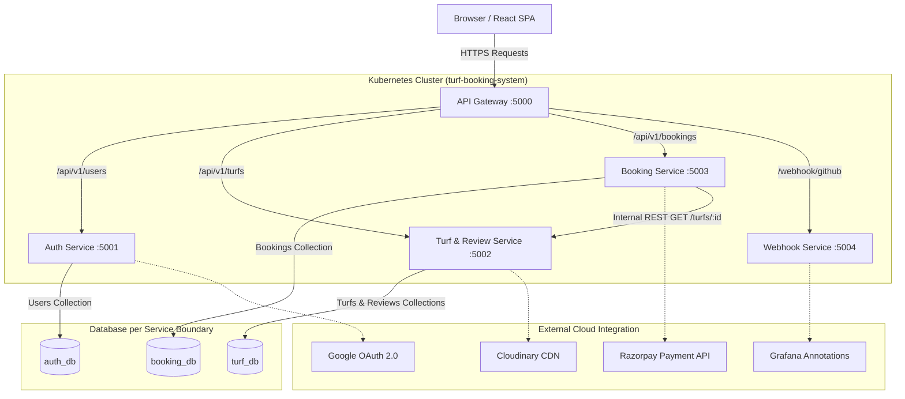

# Cloud-Native Turf Booking Microservices System

Production-grade, cloud-native microservices transformation of the MERN **Turf Booking System**. Built with decoupled Node.js/Express microservices, React SPA, Docker, Kubernetes (Kustomize, HPA, PDB, Ingress), Terraform (AWS VPC, EC2/k3s, ECR, S3, IAM, SSM), Prometheus Metrics, Grafana as Code, and GitHub Actions CI/CD.

---

## 🏗 System Architecture



---

## 📁 Repository Folder Tree

```
Turf Booking System/
├── .github/
│   └── workflows/
│       └── ci-cd.yml                # GitHub Actions OIDC + Trivy + ECR + K8s pipeline
├── docker-compose.yml               # Local multi-container dev orchestrator with healthchecks
├── k8s/                             # Declarative Kubernetes Manifests (Kustomize)
│   ├── base/
│   │   ├── namespace.yaml
│   │   ├── configmap.yaml
│   │   ├── secret.yaml
│   │   ├── ingress.yaml
│   │   ├── mongodb.yaml
│   │   ├── auth-service/            # Deployment, Service, HPA (v2), PDB (v1)
│   │   ├── turf-service/
│   │   ├── booking-service/
│   │   ├── api-gateway/
│   │   └── frontend-service/
│   ├── overlays/
│   │   ├── dev/
│   │   └── prod/
│   ├── prometheus/                  # PrometheusRules & ServiceMonitors
│   │   ├── alerts.yaml
│   │   └── servicemonitor.yaml
│   └── grafana/                     # Grafana as Code (Auto-provisioned JSON Dashboards)
│       ├── datasources.yaml
│       ├── dashboards.yaml
│       ├── dashboard-configmaps.yaml
│       └── dashboards/
│           ├── 01-service-overview-red.json
│           ├── 02-booking-business.json
│           ├── 03-k8s-scaling.json
│           ├── 04-infrastructure-node-health.json
│           └── 05-deployments-annotations.json
├── services/                        # Decoupled Independent Microservices
│   ├── api-gateway/                 # Reverse proxy, CORS, rate limiting
│   ├── auth-service/                # User auth, JWT claims, Google OAuth
│   ├── turf-service/                # Turf CRUD, Cloudinary upload, reviews
│   ├── booking-service/             # Slots, booking creation, Razorpay, double-booking lock
│   ├── frontend-service/            # React SPA + Nginx alpine
│   └── webhook-service/             # GitHub Webhooks (HMAC SHA-256 verification)
├── terraform/                       # AWS IaC (Free-tier / Low Cost Region ap-south-1)
│   ├── main.tf
│   ├── variables.tf
│   ├── outputs.tf
│   ├── backend.tf
│   ├── terraform.tfvars.example
│   └── modules/ (vpc, security_groups, ec2_k3s, ecr, s3, iam, ssm)
└── tests/
    └── k6-load-test.js              # k6 stress test simulating booking rush for HPA
```

---

## 🚀 How to Run

### **1. Run Locally (Docker Compose)**
```bash
docker compose up -d --build
```
* Access Frontend SPA: `http://localhost:80`
* Access API Gateway: `http://localhost:5000/api/v1`

### **2. Deploy to Kubernetes (minikube / kind / EKS)**
```bash
kubectl apply -k k8s/base
```
* Watch HPA Scaling live: `kubectl get hpa -n turf-booking-system -w`
* Run k6 Load Test: `k6 run tests/k6-load-test.js`

### **3. Deploy AWS Infrastructure via Terraform**
```bash
cd terraform
terraform init
terraform fmt -recursive
terraform validate
terraform plan
```

---

## 🔒 Registering GitHub Webhooks

1. Open your GitHub Repository -> **Settings -> Webhooks -> Add webhook**.
2. **Payload URL**: `http://<your-domain-or-ngrok>/webhook/github` (or use `ngrok http 5004` locally).
3. **Content type**: `application/json`.
4. **Secret**: Set `GITHUB_WEBHOOK_SECRET` matching your environment value.
5. **Events**: Select `Push`, `Pull requests`, and `Deployments`.

---

## 🎯 2-Minute Interview Explanation Cheatsheet

1. **Why Split into Microservices?**
   *"We separated the monolithic MERN backend along real domain boundaries (Auth, Turf, Booking) so each service can scale independently. Booking processing scales up during peak rushes without duplicating auth or media workloads."*
2. **How do you handle Database-per-Service Auth?**
   *"Instead of querying the User DB on every request, `auth-service` encodes user ID and role directly into signed JWT claims. Downstream services verify tokens statelessly using the shared secret without any RPC network overhead."*
3. **How is Double Booking Prevented under Kubernetes Horizontal Scaling?**
   *"We enforced an atomic MongoDB compound unique index on `{ turfId: 1, date: 1, startTime: 1, status: 'Confirmed' }`. When multiple pod replicas handle concurrent requests for the same slot, MongoDB enforces atomic lock ordering, immediately rejecting duplicates with a 400 conflict response."*
4. **Why EC2 + k3s over EKS for AWS Provisioning?**
   *"EKS costs ~\$73/month flat fee for the control plane alone. Running `k3s` on a `t3.micro` EC2 instance in `ap-south-1` costs \$0 on AWS Free Tier while giving us 100% full Kubernetes capabilities (HPA, Ingress, PDB, Prometheus)."*
5. **How does Observability & Grafana as Code work?**
   *"We instrumented Node services with `prom-client` to expose RED, business, and dependency metrics. Grafana dashboards and Prometheus alerting rules are provisioned 100% as code via Kubernetes ConfigMaps, requiring zero manual clicking."*